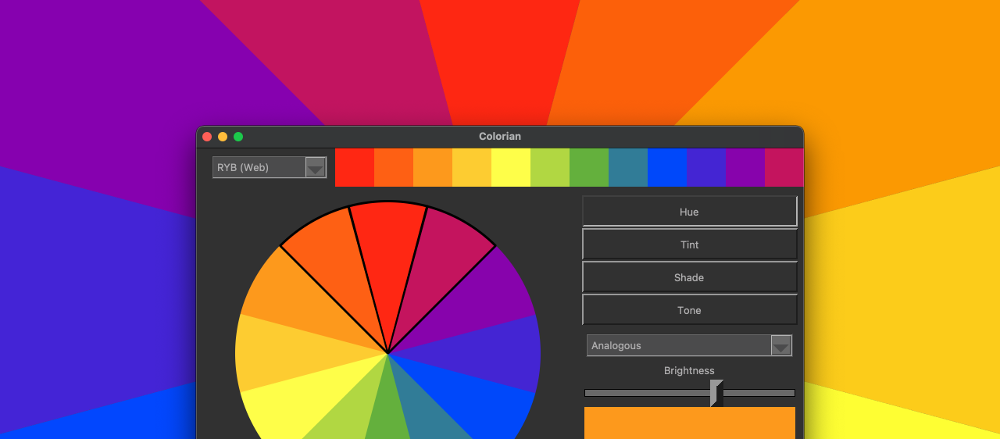

COLORIAN
========

Colorian is a color palette creator that makes finding colors that look
balanced together easy. The created palettes can be copied to clipboard or
exported to file for easy use in design projects.



## Get started

[Download Colorian app for Mac](https://github.com/laitine/colorian/releases/)

1. Choose a color wheel from the top left corner according to your intended use
of colors (RYB for web, RGB for screens or CMYK for print).

2. Pick a color from the top row color picker. A color wheel is updated
in the middle according to your selection.

3. Modify the color wheel by selecting a preferred hue variant from the right
(Hue is the default, Tint to lighten, Shade to darken and Tone to change the
saturation of the hues).

4. Select a color scheme from the dropdown on the middle right (Analogous,
Complementary, Triadic etc.) to generate a main palette below the color wheel.
The main palette colors can be clicked to automatically copy the hex color code
to clipboard for quick adding to visual design applications and code.

5. A color's brightness can be fine-tuned by clicking a color in the color
wheel and adjusting it with the slider on the lower right. A preview panel
below the slider shows the modified color.

6. Once a palette or the whole color wheel is tweaked to perfection it can be
exported to file by clicking the Export to file -button in the bottom right
corner. The exported file includes the colors in the selected palette, and the
color wheel with default names and color hex codes.


Icons by Setyo Ari Wibowo from [the Noun Project](https://thenounproject.com/seochan.art/collection/communication-thick)

Credits for color saturation calculation to [Hugh Haworth](https://css-tricks.com/using-javascript-to-adjust-saturation-and-brightness-of-rgb-colors)

## Build

The application is bundled using [PyInstaller](http://www.pyinstaller.org) on Mac.

### Bundle for distribution

Note that sudo is only needed to edit the bundle's read-only files.

```commandline
sudo pyinstaller --clean --onefile --name Colorian --windowed --icon app_icon.icns --osx-bundle-identifier com.laitine.io.colorian --add-data "noun_copy_964433.png:." --add-data "noun_sticker_964404.png:." main.py
```
```commandline
sudo pyinstaller Colorian.spec
```
```commandline
sudo python bump_version.py
```

The bundled app ready to run is in `dist/Colorian.app`.
